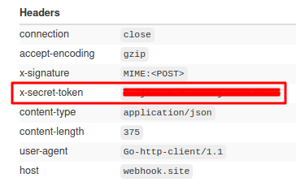

A Webhook is a way to deliver events like open, click, bounce, etc. over the HTTP Protocol which helps to integrate with various applications.

## List of Webhook Events

1. request

2. delivered

3. open

4. click

5. unsubscribe

6. bounce_soft

7. bounce_hard

8. block_soft

9. block_hard

10. spam

## Receiving format (Payload Data)

Whenever an event occurred for which you had configured your webhook, then the MimePost app will send you a post HTTP call on your given URL. The call will have string body in JSON format. The data structure (JSON) will depend on the type of event.

### Data structure / Schema of Events (with sample example data):

#### 1. request

```

{
      "message_id": "29c9690b-06f8-477f-be95-301ae2c229a5@hfn19.top",
      "event": "request",
      "datetime": "T2018-12-26 17:21:24Z+5:30",
      "summary": "email request submitted",
      "to_email": "recipient1@example.com",
      "tags":[25,24548],
      "vars": {},
      "from_email": "sender@example.com",
      "to_domain": "example.com",
      "user_id": ""
}


```

#### 2. delivered

```

{
      "message_id": "29c9690b-06f8-477f-be95-301ae2c229a5@hfn19.top",
      "event": "delivered",
      "datetime": "T2018-12-26 17:21:24Z+5:30",
      "summary": "email delivered",
      "to_email": "recipient1@example.com",
      "tags":[25,24548],
      "vars": {},
      "server_response": "Mail Accepted 250 OK"
}

```

#### 3. open

```

{
      "message_id": "29c9690b-06f8-477f-be95-301ae2c229a5@hfn19.top",
      "event": "open",
      "message_id": "",
      "datetime": "T2018-12-26 17:21:24Z+5:30",
      "summary": "email opened",
      "to_email": "recipient1@example.com",
      "tags":[25,24548],
      "vars": {},
      "ip": "103.20.39.34",
      "ip_country": "IN",
      "ip_state": "Maharashtra",
      "ip_city": "Mumbai",
      "user_agent": "Mozilla/5.0 (X11; Linux x86_64) AppleWebKit/537.36 (KHTML, like Gecko) Chrome/63.0.3239.132 Safari/537.36",
      "user_agent_type": "browser",
      "uset_agent_device": "desktop",
      "user_agent_browser": "Firefox",
      "user_agent_os": "Windows"
}


```

#### 4. click

```

{
      "message_id": "29c9690b-06f8-477f-be95-301ae2c229a5@hfn19.top",
      "event": "click",
      "datetime": "T2018-12-26 17:21:24Z+5:30",
      "summary": "email link clicked",
      "to_email": "recipient1@example.com",
      "tags":[25,24548],
      "vars": {},
      "url": "https://google.com/?q=search",
      "ip": "103.20.39.34",
      "ip_country": "IN",
      "ip_state": "Maharashtra",
      "ip_city": "Mumbai",
      "user_agent": "Mozilla/5.0 (X11; Linux x86_64) AppleWebKit/537.36 (KHTML, like Gecko) Chrome/63.0.3239.132 Safari/537.36",
      "user_agent_type": "browser",
      "user_agent_device": "desktop",
      "user_agent_browser": "Firefox",
      "user_agent_os": "Windows"
}


```

#### 5. unsubscribe

```

{
      "message_id": "29c9690b-06f8-477f-be95-301ae2c229a5@hfn19.top",
      "event": "unsubscribe",
      "datetime": "T2018-12-26 17:21:24Z+5:30",
      "summary": "email unsubscribed",
      "to_email": "recipient1@example.com",
      "tags":[25,24548],
      "vars": {},
      "url": "https://t.example.com/track/unsubscribe/",
      "ip": "103.20.39.34",
      "ip_country": "IN",
      "ip_state": "Maharashtra",
      "ip_city": "Mumbai",
      "user_agent": "Mozilla/5.0 (X11; Linux x86_64) AppleWebKit/537.36 (KHTML, like Gecko) Chrome/63.0.3239.132 Safari/537.36",
      "user_agent_type": "browser",
      "user_agent_device": "desktop",
      "user_agent_browser": "Firefox",
      "user_agent_os": "Windows"
}


```

#### 6. bounce_soft

```

{
      "message_id": "29c9690b-06f8-477f-be95-301ae2c229a5@hfn19.top",
      "event": "bounce_soft",
      "datetime": "T2018-12-26 17:21:24Z+5:30",
      "summary": "server was unable to deliver your email due to ip reject",
      "to_email": "recipient1@example.com",
      "tags":[25,24548],
      "vars": {}
}


```

#### 7. bounce_hard

```

{
      "message_id": "29c9690b-06f8-477f-be95-301ae2c229a5@hfn19.top",
      "event": "bounce_soft",
      "datetime": "T2018-12-26 17:21:24Z+5:30",
      "summary": "server was unable to deliver your email",
      "to_email": "recipient1@example.com",
      "tags":[25,24548],
      "vars": {},
      "server_response": "Jun 24 13:31:31 outgoing-smtp postfix/smtp[9632]: 3wvx6q2jBgz8yNw: to=, relay=gmail-smtp-in.l.google.com[209.85.201.26]:25, delay=0.42, delays=0.06/0.02/0.29/0.06, dsn=5.2.2, status=bounced (host gmail-smtp-in.l.google.com[209.85.201.26] said: 552-5.2.2 The email account that you tried to reach is over quota. Please direct 552-5.2.2 the recipient to 552 5.2.2 https://support.google.com/mail/?p=OverQuotaPerm l64si6959608qkl.189 - gsmtp (in reply to RCPT TO command))"
}


```

#### 8. block_soft

```

{
      "message_id": "29c9690b-06f8-477f-be95-301ae2c229a5@hfn19.top",
      "event": "block_soft",
      "datetime": "2018-12-26 17:21:24",
      "summary": "Filter: International TLD not allowed",
      "to_email": "recipient1@example.com.br",
      "tags":[25,24548],
      "vars": {}
}


```

#### 9. block_hard


```

{
      "message_id": "29c9690b-06f8-477f-be95-301ae2c229a5@hfn19.top",
      "event": "block_hard",
      "datetime": "T2018-12-26 17:21:24Z+5:30",
      "summary": "Filter: Non-deliverable email",
      "to_email": "recipient1@example.com",
      "tags":[25,24548],
      "vars": {}
}


```

#### 10. spam

```

{
      "message_id": "29c9690b-06f8-477f-be95-301ae2c229a5@hfn19.top",
      "event": "spam",
      "datetime": "T2018-12-26 17:21:24Z+5:30",
      "summary": "abuse reported by user",
      "to_email": "recipient1@example.com",
      "tags":[25,24548],
      "vars": {}
}


```


## Retry logic

In case of failure, that is when our system receives other than __200__ HTTP response code, We will retry according to the following schedule:

* 10 Minutes
* 15 Minutes
* 30 Minutes
* 1 Hour
* 2 Hour
* 4 Hour

If none of these attempts work, we store all the failed events in our internal error queue. On receiving support request, we can resend those failed events back.

User can see the failed count on the panel ([https://mimepost.com/app/integration/webhooks](https://mimepost.com/app/integration/webhooks)) and resend those events back to the URL by clicking on the __Re-Push__ option. 


## Securing Webhooks

MimePost took the simplest approach to ensure the authenticity of the events coming from MimePost and not from any other.

MimePost generate a unique secret key whenever you create a Webhook. This secret key is visible from front end as well as it get returned in API. Everytime MimePost sends event on your webhook URL, you will also get this secret key as an HTTP header of the event data. You can then match this secret key in your webhook receiving program. 

The secret key example (in Webhook HTTP calls)

```
x-secret-token: oTzN3c5sXNamsA5ODW9E2

```

A real world example




